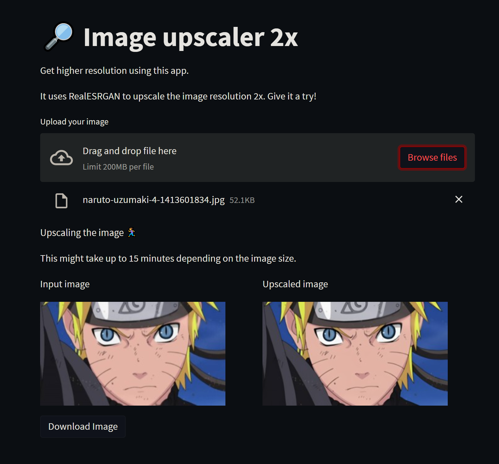

# 🔎 Image upscaler

A web app that upscales the input images x2.\
As an example you can upscale a 1920x1080 image into 4k wallpaper.\
The app uses Real-ESRGAN model, implementation taken from [boomb0om/Real-ESRGAN-colab](https://github.com/boomb0om/Real-ESRGAN-colab).

[Give it a try](https://seiilaa-streamplit-image-upscaler-streamlit-app-zy5fyq.streamlitapp.com/)

## Demo

